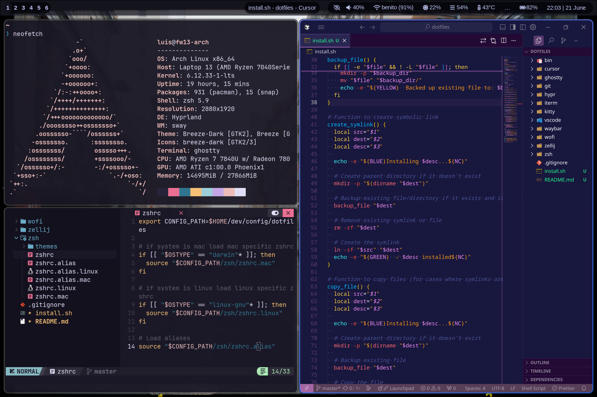

# Luis Mendoza - Dotfiles

These are a collection of personal scripts and configs I have collected over the years, I use them to maintain a standard environment across my machines. Feel free to copy, clone, take inspiration, or do whatever you want with them.

Use at your own risk and make sure you know what you are doing.

## Requirements

This scripts assumes you have the following installed:

* zsh
* oh-my-zsh
* starship
* VSCode or Cursor
* git
* mise
* neovim using NvChad 

## Platform Support

This configs can be used on Linux and/or macOS. The linux configs also support Hyprland, but can be used on Gnome or KDE as well.

Linux with Hyprland



## Quick Setup

```bash
mkdir ~/dev/config
git clone https://github.com/luismendozamx/dotfiles.git ~/dev/config/dotfiles
cd ~/dev/config/dotfiles
./install.sh
```

## What's Included

- **Shell**: Zsh configuration with custom themes and aliases
- **Terminal**: Ghostty, Kitty, and iTerm2 configurations
- **Window Manager**: Hyprland setup with Waybar and Wofi (Linux)
- **Editor**: VSCode and Cursor settings
- **Git**: Global Git configuration
- **Terminal Multiplexer**: Zellij layouts and configuration
- **Utilities**: Custom scripts in `bin/`

## Structure

```
├── bin/           # Utility scripts
├── cursor/        # Cursor editor setup
├── ghostty/       # Ghostty terminal config
├── git/           # Git configuration
├── hypr/          # Hyprland window manager (Linux)
├── kitty/         # Kitty terminal config
├── vscode/        # VSCode settings
├── waybar/        # Status bar config (Linux)
├── wofi/          # App launcher (Linux)
├── zellij/        # Terminal multiplexer
└── zsh/           # Shell configuration
```

The installation script automatically detects your OS and installs appropriate configurations. Existing files are backed up to `~/.dotfiles_backup/`.
